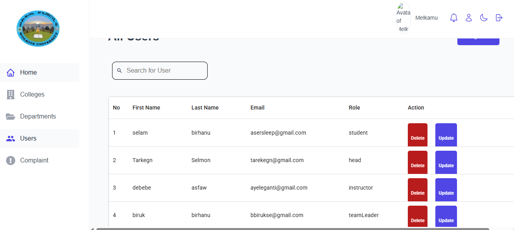
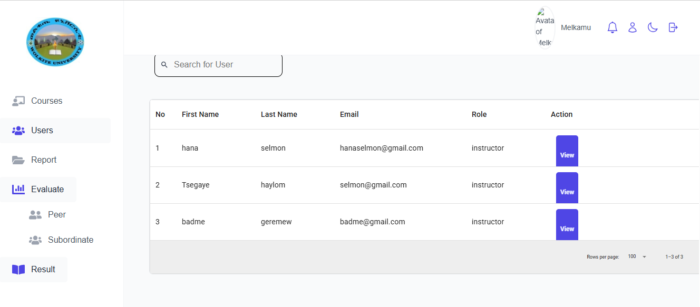
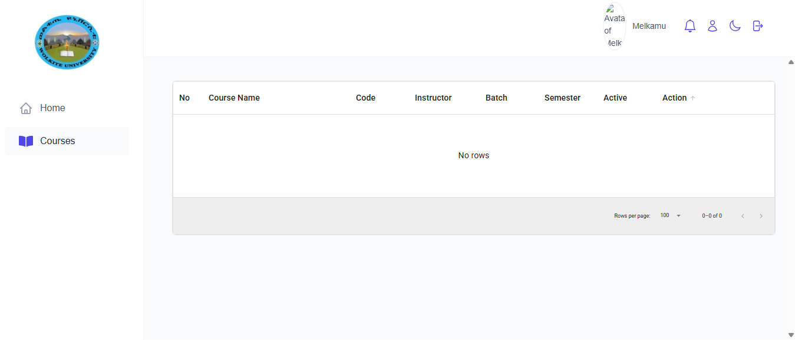
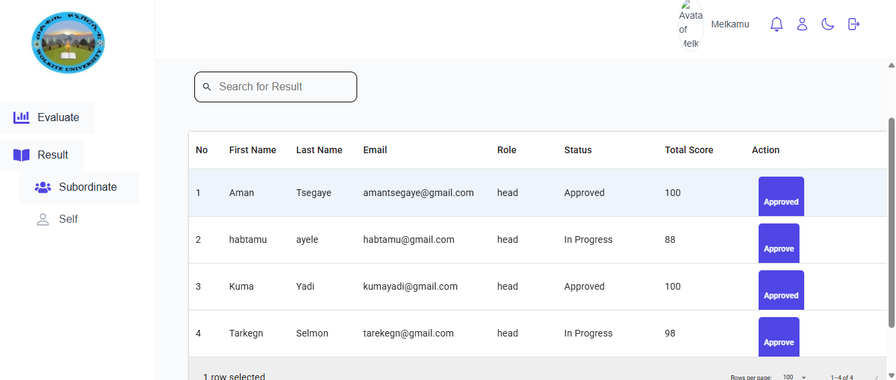

# 🎨 Performance Appraisal System (Frontend)

This is the **frontend application** of the Performance Appraisal System, built with **React**.  
It provides an interactive user interface for employees, managers, and admins to participate in performance reviews, give feedback, and track appraisal cycles.

## Live Demo

Check out the live app here:https://wkuapprisal.netlify.app/admin

---

## Screenshots






## ✨ Features

- 🔐 **Authentication & Authorization**

  - Login & signup pages
  - Role-based navigation

- 🖥️ **Dashboard**

  - User-specific dashboards
  - Overview of appraisal cycles, feedback, and ratings

- 📝 **Appraisal Management**

  - Submit self-appraisals
  - View assigned appraisals
  - Track appraisal status

- 💬 **Feedback System**

  - Peer-to-peer feedback forms
  - Manager feedback
  - Review history

- 🎨 **Modern UI/UX**

  - Responsive design using **Material UI**
  - Consistent theming and styling
  - User-friendly forms and layouts

- ⚡ **State & Data Management**
  - **React Query** for API data fetching and caching
  - Centralized API integration with backend
  - Optimistic updates & automatic re-fetching

---

## 🛠️ Tech Stack

- **Frontend Framework:** [React](https://reactjs.org/)
- **UI Library:** [Material UI](https://mui.com/)
- **Data Fetching:** [React Query](https://tanstack.com/query/latest)
- **Routing:** React Router
- **Backend Integration:** REST APIs from Node.js/Express backend

---

---

## ⚡ Getting Started

### 1. Clone the Repository

```bash
git clone https://github.com/bisratjenbere/Performance-Apprisal.git
cd Performance-Apprisal
```

### 2. Install Dependencies

```bash
npm install
```

3. Configure Environment Variables
4. REACT_APP_API_URL=http://localhost:5000/api
5. Run the Development Server

```bash
npm start


```
